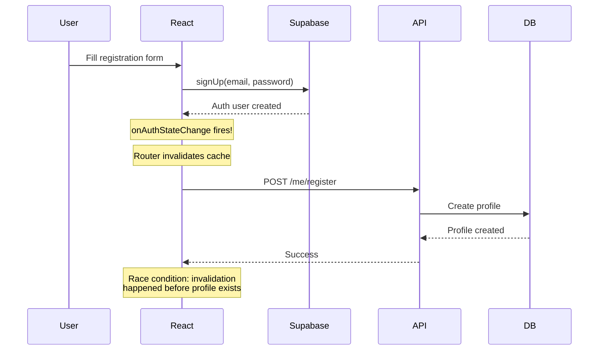
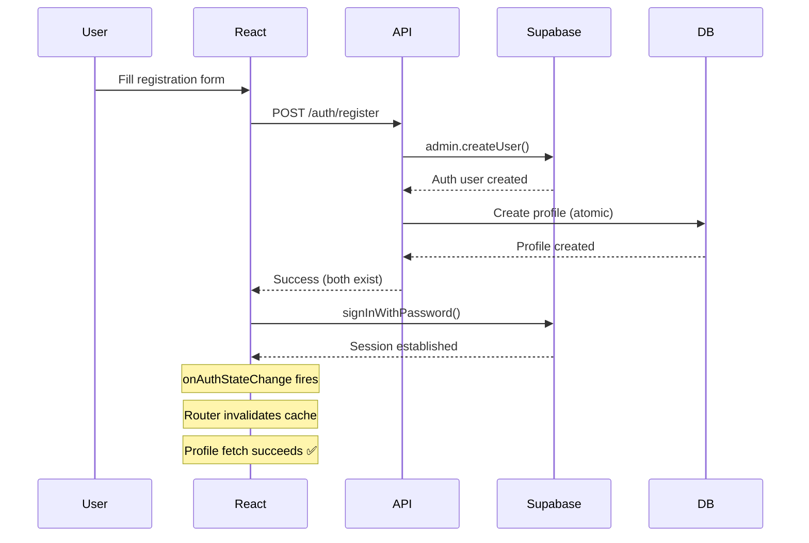

# Implementation Plan: Backend-Owned Signup Flow

**Issue**: Race condition during user registration where `onAuthStateChange` fires before profile creation completes, causing route invalidation failures.

**Solution**: Implement backend-owned atomic registration flow where .NET API creates both Supabase auth user and profile in a single transaction.

**Status**: Planning  
**Created**: 2026-01-04  
**Target Completion**: TBD

---

## Table of Contents

1. [Overview](#overview)
2. [Current vs. Proposed Architecture](#current-vs-proposed-architecture)
3. [Implementation Phases](#implementation-phases)
4. [Detailed Task Breakdown](#detailed-task-breakdown)
5. [Testing Strategy](#testing-strategy)
6. [Rollback Plan](#rollback-plan)
7. [Success Criteria](#success-criteria)

---

## Overview

### Problem Statement

Current signup flow:

1. React calls `supabase.auth.signUp()` → creates auth user
2. `onAuthStateChange` fires immediately (race condition starts)
3. React calls `userProfileService.registerUser()` → creates profile
4. Route guards attempt to fetch profile but it doesn't exist yet → failure

### Proposed Solution

Backend-owned signup flow:

1. React calls `.NET API /auth/register`
2. .NET API creates Supabase auth user via Admin API
3. .NET API creates profile in database (same transaction)
4. .NET API returns success
5. React calls `supabase.auth.signInWithPassword()`
6. `onAuthStateChange` fires with auth state
7. Route guards fetch profile → **profile exists** ✅

### Benefits

- ✅ Eliminates race condition
- ✅ Atomic transaction (rollback if profile creation fails)
- ✅ Single source of truth (backend owns registration)
- ✅ Better testability (no Supabase client mocks in tests)
- ✅ Better error handling (single endpoint)
- ✅ Security (service role key never exposed)

---

## Current vs. Proposed Architecture

### Current Flow



### Proposed Flow



---

## Implementation Phases

### Phase 1: Backend Implementation (API)

- Create Supabase Admin Service
- Create Auth endpoints
- Create request/response models
- Update configuration
- Write unit tests

**Estimated Time**: 4-6 hours

### Phase 2: Frontend Implementation (React)

- Create auth service
- Update AuthContext
- Update SignUpForm
- Remove old service methods
- Write unit tests

**Estimated Time**: 2-3 hours

### Phase 3: Integration Testing

- Test complete registration flow
- Test error scenarios
- Test rollback scenarios
- Performance testing

**Estimated Time**: 2-3 hours

### Phase 4: Deployment & Cleanup

- Deploy backend changes
- Deploy frontend changes
- Monitor for issues
- Remove old endpoints

**Estimated Time**: 1-2 hours

**Total Estimated Time**: 9-14 hours

---

## Detailed Task Breakdown

### Phase 1: Backend Implementation

#### Task 1.1: Install Supabase .NET Library

- [ ] Add `Supabase.Realtime` NuGet package to F1CompanionApi project
- [ ] Verify package version compatibility with existing packages
- [ ] Run `dotnet restore` to ensure dependencies resolve

**Files Modified**: `F1CompanionApi.csproj`

---

#### Task 1.2: Create Supabase Admin Service

- [ ] Create `ISupabaseAdminService` interface
  - Method: `Task<User> CreateUserAsync(string email, string password, Dictionary<string, object>? metadata)`
- [ ] Implement `SupabaseAdminService` class
  - Initialize Supabase client with service role key
  - Implement `CreateUserAsync` with error handling
  - Add structured logging via Sentry
- [ ] Add comprehensive XML documentation

**New Files**:

- `F1CompanionApi/Domain/Services/SupabaseAdminService.cs`

**Code Template**:

```csharp
using Supabase;
using Supabase.Gotrue;

namespace F1CompanionApi.Domain.Services;

public interface ISupabaseAdminService
{
    Task<User> CreateUserAsync(string email, string password, Dictionary<string, object>? metadata = null);
}

public class SupabaseAdminService : ISupabaseAdminService
{
    private readonly Client _adminClient;
    private readonly ILogger<SupabaseAdminService> _logger;

    public SupabaseAdminService(IConfiguration configuration, ILogger<SupabaseAdminService> logger)
    {
        // Implementation from main response
    }

    public async Task<User> CreateUserAsync(string email, string password, Dictionary<string, object>? metadata = null)
    {
        // Implementation from main response
    }
}
```

---

#### Task 1.3: Create Auth Models

- [ ] Create `RegisterRequest` record
  - Fields: Email, Password, DisplayName (optional)
  - Add validation attributes
- [ ] Create `RegisterResponse` record
  - Fields: Profile, Session (optional for MVP)
- [ ] Create `SessionResponse` record (future enhancement)
  - Fields: AccessToken, RefreshToken, ExpiresIn, TokenType

**New Files**:

- `F1CompanionApi/Api/Models/AuthModels.cs`

**Code Template**:

```csharp
namespace F1CompanionApi.Api.Models;

public record RegisterRequest(
    string Email,
    string Password,
    string? DisplayName = null
);

public record RegisterResponse(
    UserProfileResponse Profile,
    string Message
);
```

---

#### Task 1.4: Create Auth Endpoints

- [ ] Create `AuthEndpoints` static class
- [ ] Implement `MapAuthEndpoints` extension method
- [ ] Implement `RegisterAsync` private method
  - Validate request
  - Create Supabase auth user via admin service
  - Create user profile via user profile service
  - Handle errors and rollback
  - Add structured logging
- [ ] Configure endpoint as `AllowAnonymous`
- [ ] Add OpenAPI documentation

**New Files**:

- `F1CompanionApi/Api/Endpoints/AuthEndpoints.cs`

**Code Template**:

```csharp
using F1CompanionApi.Api.Models;
using F1CompanionApi.Domain.Services;
using Microsoft.AspNetCore.Mvc;

namespace F1CompanionApi.Api.Endpoints;

public static class AuthEndpoints
{
    public static IEndpointRouteBuilder MapAuthEndpoints(this IEndpointRouteBuilder app)
    {
        var authGroup = app.MapGroup("/auth");

        authGroup.MapPost("/register", RegisterAsync)
            .WithName("Register")
            .WithOpenApi()
            .WithDescription("Register new user - creates auth account and profile atomically")
            .AllowAnonymous();

        return app;
    }

    private static async Task<IResult> RegisterAsync(
        [FromBody] RegisterRequest request,
        ISupabaseAdminService supabaseAdmin,
        IUserProfileService userProfileService,
        ILogger logger
    )
    {
        // Implementation from main response
    }
}
```

---

#### Task 1.5: Register Services

- [ ] Register `ISupabaseAdminService` in dependency injection
- [ ] Map auth endpoints in endpoint configuration
- [ ] Verify service lifetime (Scoped recommended)

**Files Modified**:

- `F1CompanionApi/Extensions/ServiceExtensions.cs`
- `F1CompanionApi/Api/Endpoints/Endpoints.cs`

**Changes**:

```csharp
// ServiceExtensions.cs
services.AddScoped<ISupabaseAdminService, SupabaseAdminService>();

// Endpoints.cs
app.MapAuthEndpoints();
```

---

#### Task 1.6: Update Configuration

- [ ] Add `Supabase:ServiceRoleKey` to appsettings.json structure
- [ ] Add `Supabase:Url` configuration
- [ ] Document environment variables needed
- [ ] Update .gitignore to prevent committing service role key
- [ ] Create appsettings.Development.json.example template

**Files Modified**:

- `F1CompanionApi/appsettings.json`
- `F1CompanionApi/.gitignore`

**New Files**:

- `F1CompanionApi/appsettings.Development.json.example`

**Configuration Template**:

```json
{
  "Supabase": {
    "Url": "https://your-project.supabase.co",
    "JwtSecret": "your-jwt-secret",
    "ServiceRoleKey": "your-service-role-key"
  }
}
```

---

#### Task 1.7: Write Backend Unit Tests

- [ ] Create `SupabaseAdminServiceTests.cs`
  - Test successful user creation
  - Test error handling (invalid email, duplicate user)
  - Test metadata handling
- [ ] Create `AuthEndpointsTests.cs`
  - Test successful registration
  - Test validation errors
  - Test duplicate user conflict
  - Test rollback on profile creation failure
- [ ] Ensure test coverage meets project standards

**New Files**:

- `F1CompanionApi.UnitTests/Domain/Services/SupabaseAdminServiceTests.cs`
- `F1CompanionApi.UnitTests/Api/Endpoints/AuthEndpointsTests.cs`

---

### Phase 2: Frontend Implementation

#### Task 2.1: Create Auth Service

- [ ] Create `authService.ts` module
- [ ] Implement `register()` method - calls API endpoint
- [ ] Implement `signIn()` method - wraps Supabase client
- [ ] Implement `signOut()` method - wraps Supabase client
- [ ] Add TypeScript interfaces for request/response
- [ ] Add comprehensive JSDoc documentation

**New Files**:

- `src/services/authService.ts`

**Code Template**:

```typescript
import type { UserProfile } from '@/contracts/UserProfile';
import { apiClient } from '@/lib/api';
import { supabase } from '@/lib/supabase';
import type { Session, User } from '@supabase/supabase-js';

export interface RegisterRequest {
  email: string;
  password: string;
  displayName?: string;
}

export interface RegisterResponse {
  profile: UserProfile;
  message: string;
}

export const authService = {
  async register(data: RegisterRequest): Promise<RegisterResponse> {
    return apiClient.post<RegisterResponse, RegisterRequest>(
      '/auth/register',
      data,
      'register account',
    );
  },

  async signIn(email: string, password: string): Promise<{ user: User; session: Session }> {
    // Implementation from main response
  },

  async signOut(): Promise<void> {
    // Implementation from main response
  },
};
```

---

#### Task 2.2: Update AuthContext Interface

- [ ] Change `signUp` method signature to accept `RegisterRequest`
- [ ] Remove `CreateProfileData` dependency
- [ ] Update JSDoc comments

**Files Modified**:

- `src/contexts/AuthContext.ts`

**Changes**:

```typescript
import type { RegisterRequest } from '@/services/authService';

export interface AuthContextType {
  user: User | null;
  session: Session | null;
  loading: boolean;
  signIn: (email: string, password: string) => Promise<void>;
  signUp: (data: RegisterRequest) => Promise<void>; // Changed
  signOut: () => Promise<void>;
}
```

---

#### Task 2.3: Update AuthProvider Implementation

- [ ] Import `authService` instead of calling Supabase directly
- [ ] Update `signUp` implementation to:
  1. Call `authService.register()`
  2. Call `authService.signIn()` on success
  3. Handle errors with Sentry logging
- [ ] Update `signIn` to use `authService.signIn()`
- [ ] Update `signOut` to use `authService.signOut()`
- [ ] Remove `userProfileService` import and usage

**Files Modified**:

- `src/contexts/AuthContext.tsx`

**Changes**:

```typescript
import { authService } from '@/services/authService';
import type { RegisterRequest } from '@/services/authService';

// In signUp method:
const signUp = async (data: RegisterRequest) => {
  try {
    await authService.register(data);
    Sentry.logger.info('Registration successful', { email: data.email });

    await authService.signIn(data.email, data.password);
  } catch (error) {
    Sentry.captureException(error, {
      contexts: { auth: { email: data.email, operation: 'signup' } },
    });
    throw error;
  }
};
```

---

#### Task 2.4: Update SignUpForm Component

- [ ] Update `handleSubmit` to pass object to `signUp()`
- [ ] Remove `CreateProfileData` construction
- [ ] Update error handling messages
- [ ] Ensure form validation remains intact

**Files Modified**:

- `src/components/auth/SignUpForm/SignUpForm.tsx`

**Changes**:

```typescript
const handleSubmit = async (e: FormEvent) => {
  e.preventDefault();
  setIsLoading(true);
  setError(null);

  // Validation...

  try {
    await signUp({ email, password, displayName });
    // Success - router handles navigation
  } catch (error) {
    const errorMessage = error instanceof Error ? error.message : 'Sign up failed';
    setError(errorMessage);
    announce(errorMessage);
  } finally {
    setIsLoading(false);
  }
};
```

---

#### Task 2.5: Remove Old Service Methods

- [ ] Remove `registerUser()` method from `userProfileService`
- [ ] Update exports if needed
- [ ] Search codebase for any remaining usage

**Files Modified**:

- `src/services/userProfileService.ts`

**Changes**:

```typescript
// Remove this entire method:
// async registerUser(data: CreateProfileData): Promise<UserProfile> { ... }
```

---

#### Task 2.6: Write Frontend Unit Tests

- [ ] Update `AuthContext.test.tsx`
  - Test new `signUp` flow (register + signIn)
  - Test error handling
  - Mock `authService` instead of Supabase
- [ ] Update `SignUpForm.test.tsx`
  - Test form submission with new flow
  - Test validation errors
  - Test network errors
- [ ] Create `authService.test.ts`
  - Test `register()` method
  - Test `signIn()` method
  - Test `signOut()` method
- [ ] Ensure test coverage meets project standards

**Files Modified**:

- `src/contexts/AuthContext.test.tsx`
- `src/components/auth/SignUpForm/SignUpForm.test.tsx`

**New Files**:

- `src/services/authService.test.ts`

---

### Phase 3: Integration Testing

#### Task 3.1: Manual Testing - Happy Path

- [ ] Test complete registration flow
  1. Fill registration form
  2. Submit form
  3. Verify API creates auth user
  4. Verify API creates profile
  5. Verify auto-signin succeeds
  6. Verify route navigation works
  7. Verify no race condition errors

**Test Checklist**:

- [ ] User can register with valid credentials
- [ ] User is automatically signed in after registration
- [ ] User profile loads correctly on first page
- [ ] No console errors during flow
- [ ] Sentry logs show successful registration

---

#### Task 3.2: Manual Testing - Error Scenarios

- [ ] Test validation errors
  - [ ] Empty email
  - [ ] Invalid email format
  - [ ] Empty password
  - [ ] Short password (< 6 chars)
  - [ ] Password mismatch
- [ ] Test duplicate user registration
- [ ] Test network errors
- [ ] Test API errors

**Expected Behavior**:

- Clear error messages displayed
- No partial account creation
- User can retry registration

---

#### Task 3.3: Manual Testing - Edge Cases

- [ ] Test with special characters in email
- [ ] Test with special characters in display name
- [ ] Test with very long display name
- [ ] Test rapid form submissions
- [ ] Test browser back button during registration
- [ ] Test page refresh during registration

---

#### Task 3.4: Automated Integration Tests (Optional)

- [ ] Create E2E test for registration flow (if E2E suite exists)
- [ ] Test registration + immediate navigation
- [ ] Test registration + profile fetch

---

### Phase 4: Deployment & Cleanup

#### Task 4.1: Backend Deployment

- [ ] Update production environment variables
  - [ ] Add `Supabase:ServiceRoleKey` to production config
  - [ ] Verify `Supabase:Url` is correct
- [ ] Deploy backend changes
- [ ] Verify `/auth/register` endpoint is accessible
- [ ] Test endpoint with Postman/curl in production

**Deployment Checklist**:

- [ ] Environment variables configured
- [ ] Service starts without errors
- [ ] Endpoint responds correctly
- [ ] Logs show no configuration errors

---

#### Task 4.2: Frontend Deployment

- [ ] Deploy frontend changes
- [ ] Verify signup flow works in production
- [ ] Monitor error logs in Sentry

**Deployment Checklist**:

- [ ] Build succeeds
- [ ] No TypeScript errors
- [ ] No ESLint errors
- [ ] Registration flow works end-to-end

---

#### Task 4.3: Monitoring & Validation

- [ ] Monitor Sentry for errors (first 24 hours)
- [ ] Check application logs for issues
- [ ] Verify no spike in error rates
- [ ] Test registration as end user

**Metrics to Monitor**:

- Registration success rate
- API response times
- Error rates
- User complaints

---

#### Task 4.4: Cleanup Old Code

- [ ] Remove `POST /me/register` endpoint from backend
- [ ] Remove `RegisterUserRequest` model from backend
- [ ] Remove `CreateProfileData` contract from frontend (if unused)
- [ ] Update API documentation
- [ ] Remove deprecated tests

**Files to Remove/Modify**:

- Backend: `MeEndpoints.cs` (remove RegisterUserAsync)
- Frontend: `contracts/CreateProfileData.ts` (if unused elsewhere)

---

## Testing Strategy

### Unit Tests

**Backend (.NET)**:

- `SupabaseAdminService` - mock Supabase client
- `AuthEndpoints` - mock admin service and user profile service
- Test validation, success, errors, rollback

**Frontend (React)**:

- `authService` - mock apiClient and supabase
- `AuthContext` - mock authService
- `SignUpForm` - mock useAuth hook

### Integration Tests

**Backend**:

- Test `/auth/register` endpoint with test database
- Verify both auth user and profile created
- Test rollback on profile creation failure

**Frontend**:

- Test SignUpForm submission flow
- Test AuthContext state updates
- Test route navigation after signup

### Manual Testing

- Complete signup flow in development
- Error scenarios (validation, network, conflicts)
- Edge cases (special characters, rapid clicks)
- Browser compatibility

---

## Rollback Plan

### If Issues Discovered During Deployment

**Option 1: Frontend Rollback Only**

1. Revert frontend to previous version
2. Old flow still works (calls `/me/register`)
3. New endpoint remains but unused

**Option 2: Full Rollback**

1. Revert frontend deployment
2. Revert backend deployment
3. Verify old flow works
4. Investigate issues before retry

### Rollback Checklist

- [ ] Identify issue causing rollback
- [ ] Document issue for post-mortem
- [ ] Execute rollback (frontend/backend/both)
- [ ] Verify old flow works
- [ ] Communicate status to team
- [ ] Plan fix and redeployment

---

## Success Criteria

### Must Have

- ✅ Users can register successfully
- ✅ No race condition errors during signup
- ✅ Profile exists before first route load
- ✅ Error handling works correctly
- ✅ No degradation in user experience

### Nice to Have

- ✅ Improved registration latency
- ✅ Better error messages
- ✅ Session tokens returned from backend (future)
- ✅ Comprehensive E2E tests

### Metrics

- **Registration Success Rate**: > 99%
- **Error Rate**: < 1% (excluding validation errors)
- **P95 Response Time**: < 2 seconds
- **Zero race condition errors** in Sentry

---

## Risk Assessment

### High Risk

- **Service role key security**: Key must never be committed or exposed
- **Rollback of auth user**: If profile creation fails, need to delete auth user
- **Production environment variables**: Missing config breaks registration

### Medium Risk

- **Supabase API rate limits**: Admin API calls might hit limits at scale
- **Transaction failures**: Database/network issues during registration
- **Session establishment**: Auto-signin might fail in edge cases

### Low Risk

- **Frontend caching**: Old code might be cached in browsers
- **Type mismatches**: API/frontend contract differences
- **Test coverage**: Missing edge cases in tests

### Mitigation Strategies

- Store service role key in secure secret manager
- Implement compensation logic for auth user deletion
- Add environment variable validation on startup
- Implement retry logic with exponential backoff
- Add comprehensive error logging
- Test thoroughly in staging environment

---

## Dependencies

### Backend

- Supabase .NET client library (Supabase.Realtime)
- Existing UserProfileService
- Existing authentication middleware
- Database with migrations applied

### Frontend

- Existing apiClient utility
- Existing Supabase client
- TanStack Router
- Sentry for logging

### External

- Supabase project with Admin API enabled
- Service role key access
- Database connection

---

## Timeline

### Week 1

- Day 1-2: Backend implementation (Tasks 1.1-1.6)
- Day 3: Backend testing (Task 1.7)
- Day 4-5: Frontend implementation (Tasks 2.1-2.5)

### Week 2

- Day 1: Frontend testing (Task 2.6)
- Day 2: Integration testing (Tasks 3.1-3.3)
- Day 3: Deployment preparation
- Day 4: Backend deployment (Task 4.1)
- Day 5: Frontend deployment + monitoring (Tasks 4.2-4.3)

### Week 3

- Day 1-2: Monitoring period
- Day 3: Cleanup old code (Task 4.4)
- Day 4-5: Documentation and retrospective

**Total Duration**: 2-3 weeks (accounting for testing and monitoring)

---

## Notes

- This plan assumes no major blockers or surprises
- Timeline can be compressed if team has availability
- Consider feature flag for gradual rollout
- Document all environment variables needed
- Update team wiki with new authentication flow
- Consider implementing session token return in future iteration

---

## References

- [ASP.NET Core Identity API Documentation](https://learn.microsoft.com/en-us/aspnet/core/security/authentication/identity-api-authorization)
- [Supabase Admin API Documentation](https://supabase.com/docs/reference/javascript/auth-admin-createuser)
- [TanStack Router Authentication Guide](https://tanstack.com/router/latest/docs/framework/react/guide/authenticated-routes)
- Project Architecture Documentation (see `/docs` folder)
